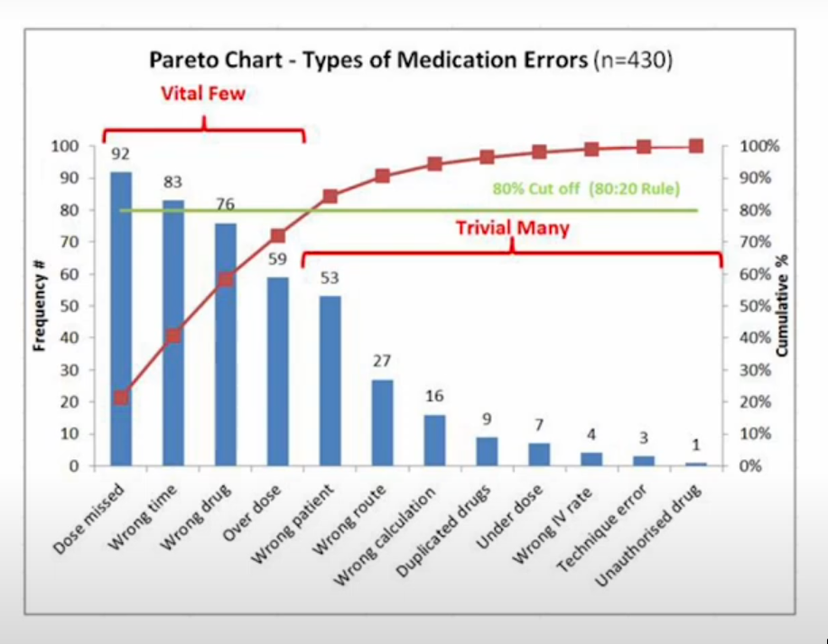
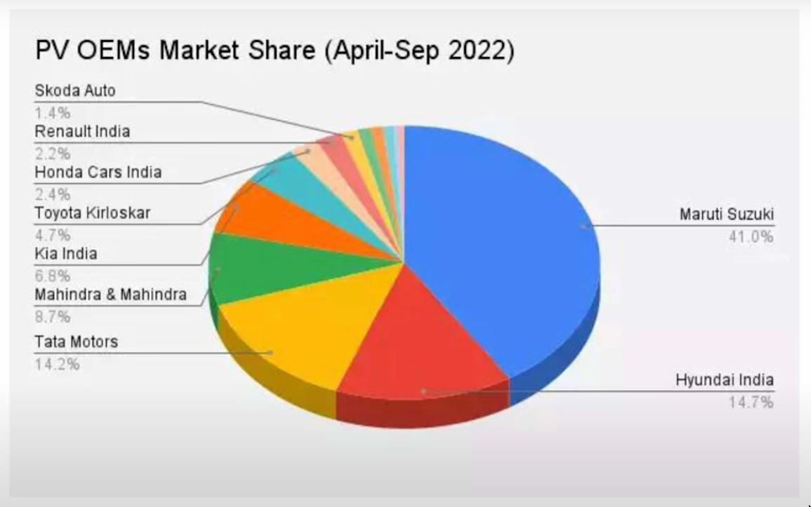
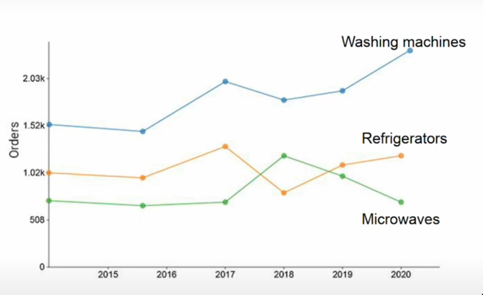
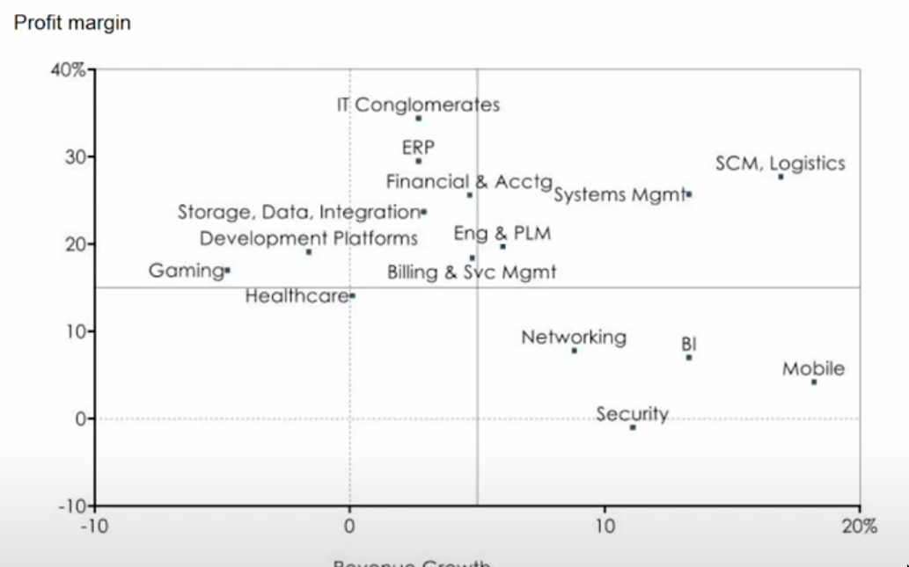

# BUSINESS DATA MANAGEMENT

Majority of the data sets and analyses that we will come across will be from the space of businesses
* from within companies
* from the market in which the company operates

### Different Types Of Charts
##### Pareto Charts

##### Pie Charts

##### Trend Charts

##### 2x2 Scatter Diagrams

#### week 1-4: extenral data analysis
#### week 5-12: internal data analysis

