# BUSINESS DATA MANAGEMENT

Majority of the data sets and analyses that we will come across will be from the space of businesses
* from within companies
* from the market in which the company operates

## Different Types Of Charts
##### Pareto Charts

##### Pie Charts

##### Trend Charts

##### 2x2 Scatter Diagrams

#### week 1-4: extenral data analysis
#### week 5-12: internal data analysis

## Introduction to Economics:

Economics tries to create mathematical models that can be used to explain economic behaviour of people and firms

##### Trade creates value:

* Punjab:
    * produces more wheat than they need
    * needs mobiles that cannot be produced locally
* Tamil Nadu: 
    * produces more mobiles than what is needed locally
    * needs wheat that cannot be produces locally

* here punjab has very little value for the excess wheat while tamilnadu values wheat highly
* while tamilnadu has very little value for the excess  mobiles and punjab values mobiles highly

#### Barter Trade
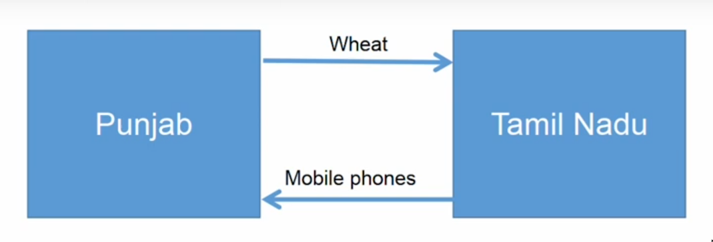

the barter trade between punjab and tamilnadu increases the value of both

now a days trade is settled using money

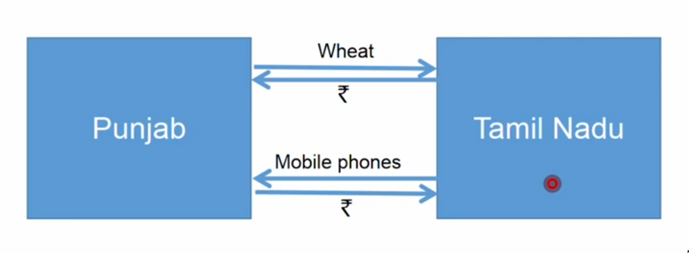

A better way to put it is

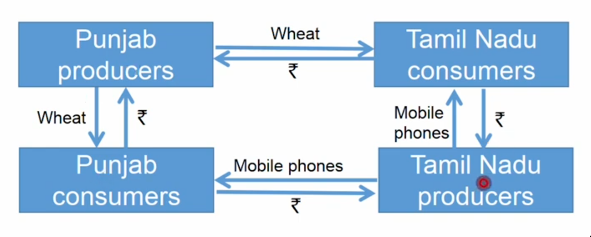

if we put the producers on one side and consumers on the other side

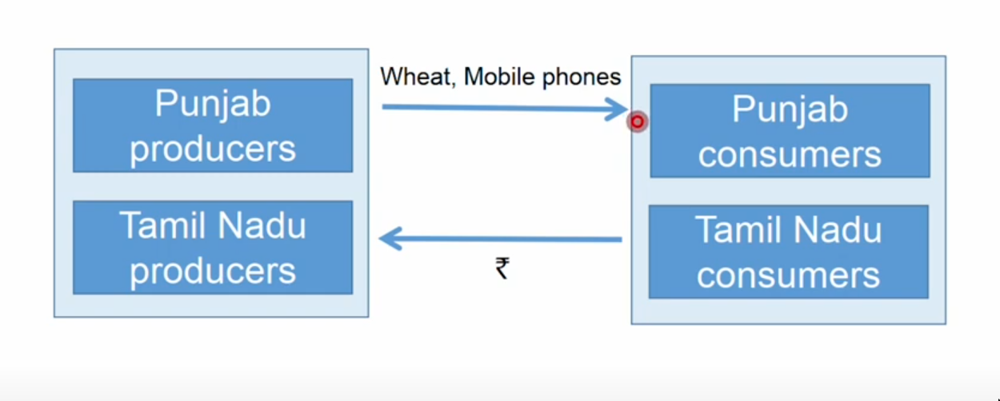

how does the consumers get the money in the above picture

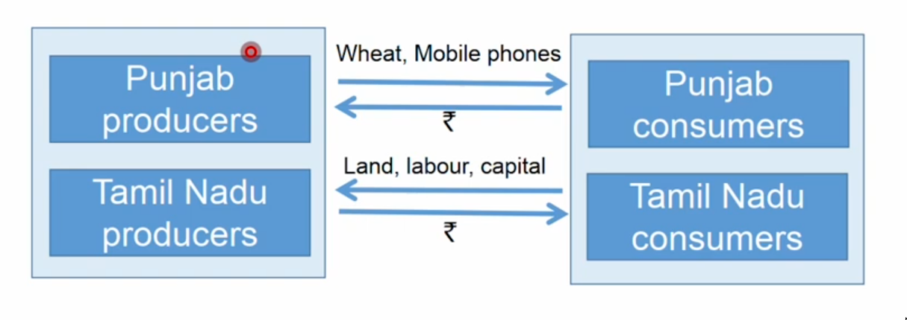

land labour and capital are the key things needed by producers and they all come from the consumers

consumers give land, labour and capital to the producers to make money and they spend the money by spending it on the goods from the producers

lets generalise this to just producers and consumers

here we put households since we don't buy just for ourselves we buy it for a family

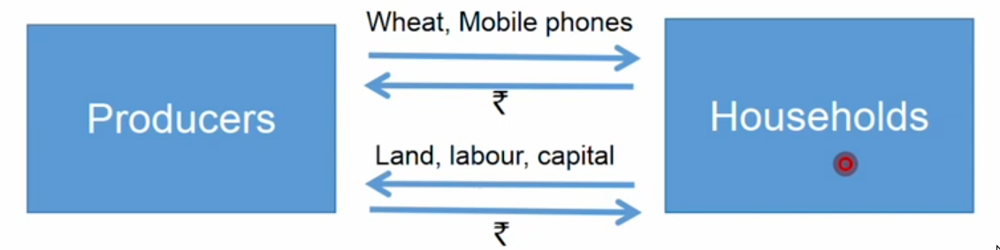

consumers don't just buy directly from the producers and it needs a lot of intermediaries

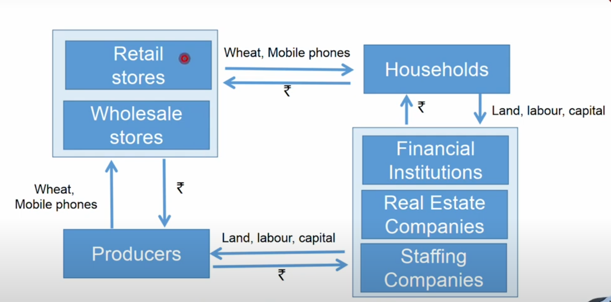

* everything in the chart other than the households are called firms

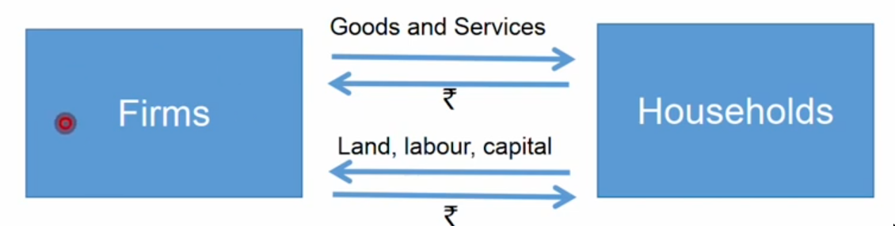

## The law of demand and supply

the amout of items a consumer buys decreases as price increases

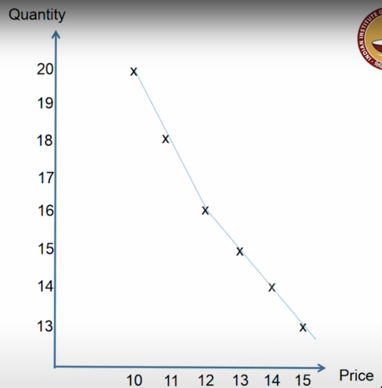

whereas the no of items a supplier would like to sell decreses as price decreases since they want to make more profit

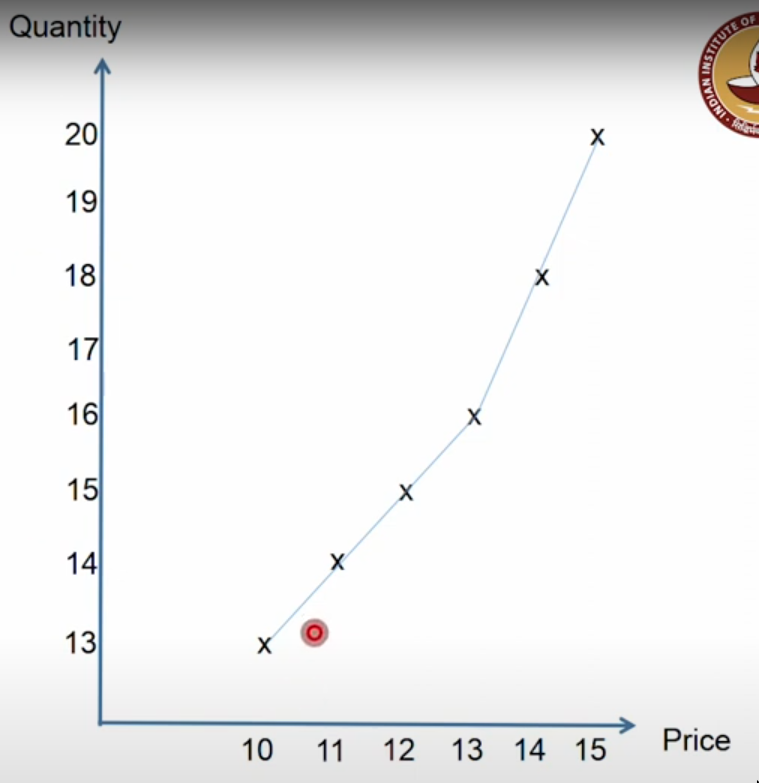

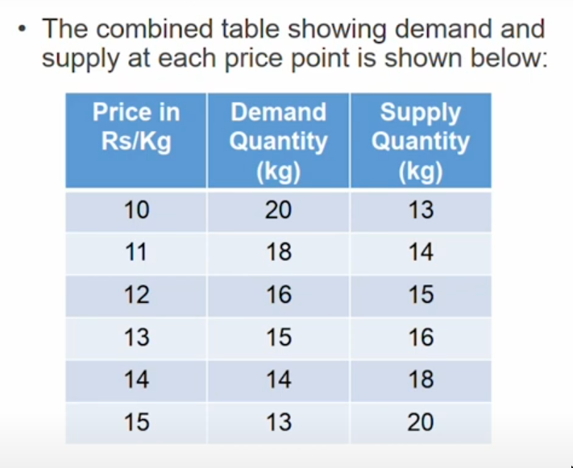

if the shopkeeper keeps the price too high the demand will reduce so that the shopkeeper has to reduce the price
if the shopkeeper keeps the price too low then demand will increase so that the shopkeeper will increase the price

the above process results in equillibrium price and equllibrium quantity which in this case is
* equillibrium price = Rs.12.5
* equillibrium quantity = 15.5 kg

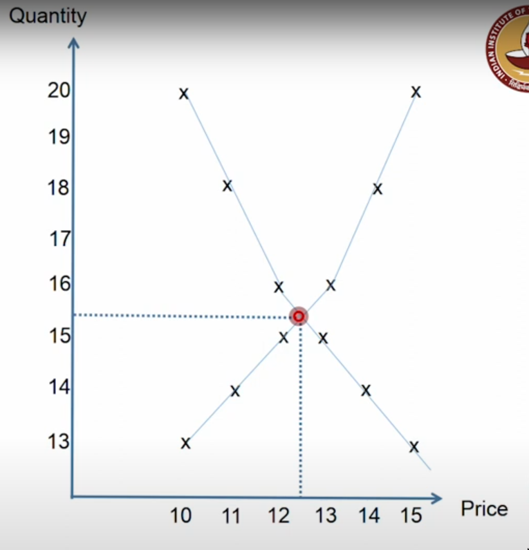

* we can say that price is the result of market actions by consumers and suppliers

* sometimes the price is the outcome of demand

#### Effect of income:

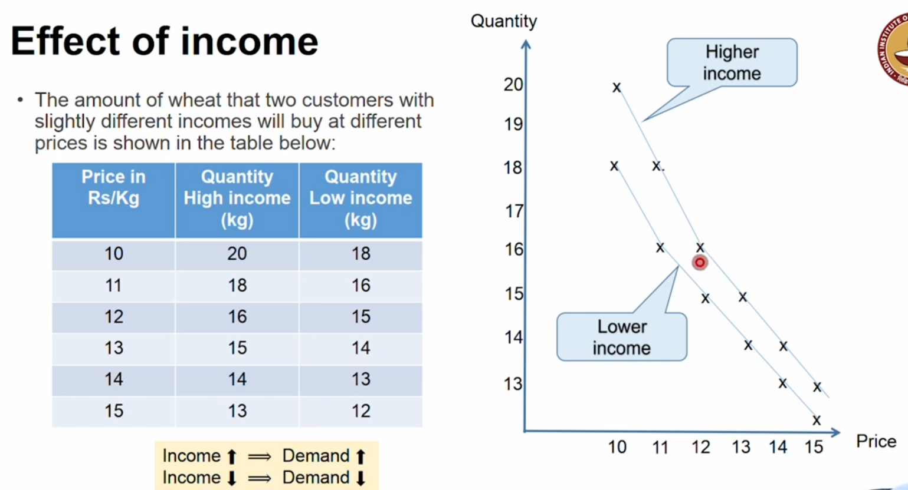

* It is also possible that at higher income some customers may choose to go with rice instead of wheat (which may be any reason such as rice is easier to cook, etc).
* This will result in decrease in wheat demand
* Then wheat is called an inferior good

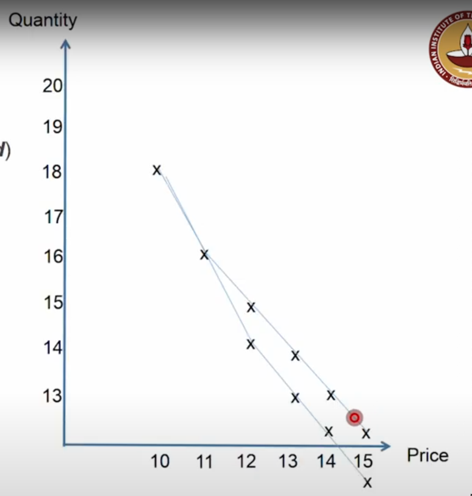
